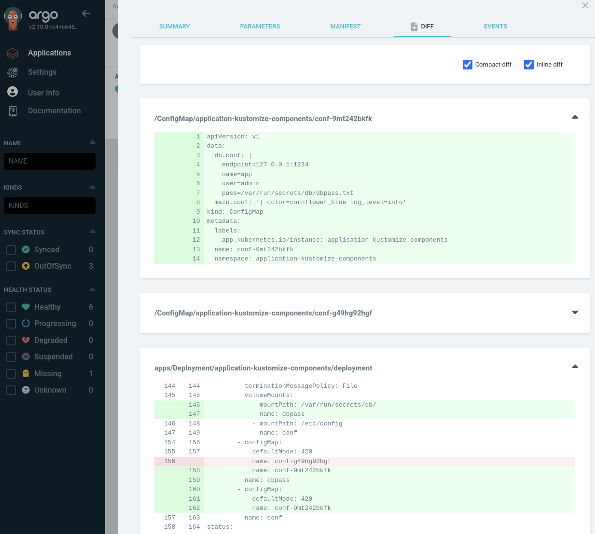

# Argo CD 2.10 Examples
## Kustomize Components Support
Implemented in [#16230](https://github.com/argoproj/argo-cd/pull/16230) by [pasha-codefresh](https://github.com/pasha-codefresh), closing [#15925](https://github.com/argoproj/argo-cd/issues/15925).

Kustomize components encapsulate both resources and patches together. They provide a powerful way to modularize and reuse configuration in Kubernetes applications.

This is loosely based on [the kustomize components example](https://github.com/kubernetes-sigs/kustomize/blob/master/examples/components.md).
- The kustomize `base/` generates a `Deployment` and a `ConfigMap` for an example application.
- The kustomize `component/` adds in the database configuration to the `ConfigMap` and patches the `Deployment` to mount in a database secret.



Normally you'd need to add the following to the `kustomization.yaml` that the Argo CD Application is referencing. For example:
```yaml
apiVersion: kustomize.config.k8s.io/v1beta1
kind: Kustomization
# ...
components:
- ../component
```

However, with support added for components, you can now reference directly in the Application:
```yaml
apiVersion: argoproj.io/v1alpha1
kind: Application
metadata:
  name: application-kustomize-components
spec:
  # ...
  source:
    path: examples/application-kustomize-components/base
    repoURL: https://github.com/morey-tech/argocd-v2.10-examples.git
    targetRevision: main
    
    # This!
    kustomize:
      components:
        - ../component
```