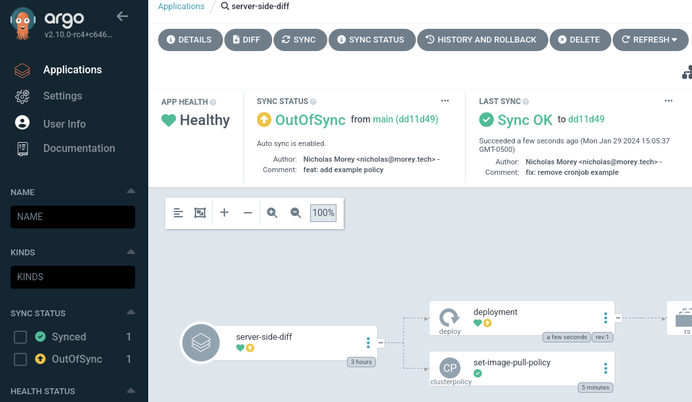
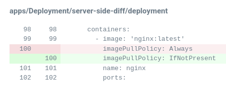

# Argo CD 2.10 Examples
## Server-Side Diff
> Argo CD main diff strategy uses a 3-way comparison between live, desired and last-applied-configuration states. However, with the introduction of Server-Side Apply (SSA) as a new sync option in version 2.5, we implemented a new diff logic based on the kubernetes library called “structured-merge-diff”. Since then, we learned from the community about the different limitations with our new approach.
> 
> To address these issues, we’re introducing a new diff option that performs a SSA in dry-run mode to determine the predicted live state. By caching the SSA response, we can reduce the load on the Kubernetes API and reduce inconsistencies with CRD schema updates. Comparing the SSA response with the live state will give us a more accurate and efficient assessment of resource sync.
> 
> One additional benefit of this new feature is that it addresses the current limitations with admission controllers, where mutation and validation webhooks are only executed in the cluster. With this new feature, admission controllers will be executed as part of the diffing stage.

https://blog.argoproj.io/argo-cd-v2-10-release-candidate-f69ba7bf9e06

> Diff strategy to invoke a Server-Side Apply in dryrun mode in order to generate the predicted live state.
> 
> Server-Side Apply requests to Kube API are only triggered when:
> 
> - An Application refresh or hard-refresh is requested.
> - There is a new revision in the repo which the Argo CD Application is targeting.
> - The Argo CD Application spec changed.
>
> Server-Side Diff does not include changes made by mutation webhooks by default.

https://argo-cd.readthedocs.io/en/latest/user-guide/diff-strategies/#server-side-diff

Implemented in [#13663](https://github.com/argoproj/argo-cd/pull/13663) by [leoluz](https://github.com/leoluz).

### Mutating Webhooks (Kyverno)
Server-Side diff will address the limitation where admission controllers with mutating webhooks are only executed in the cluster, leading to a diff between the desired state (before the mutation) and the live state (after mutation). Server-Side diff will be a huge improvement for working with Kyverno policies with mutating rules for resources managed by Argo CD.

Take for example, a mutation policy that automatically sets the `ImagePullPolicy` on `Deployments` to `Always` where the image is using the `latest` tag.
```yaml
apiVersion: kyverno.io/v1
kind: ClusterPolicy
metadata:
  name: set-image-pull-policy
spec:
  rules:
    - name: set-image-pull-policy
      match:
        any:
        - resources:
            kinds:
            - Deployment
            namespaces:
            - server-side-diff
      mutate:
        patchStrategicMerge:
          spec:
            template:
              spec:
                containers:
                  # match images which end with :latest
                  - (image): "*:latest"
                    # set the imagePullPolicy to "Always"
                    imagePullPolicy: "Always"
```

Without using server-side diff, the Application will be perpetually out-of-sync if the desired state does not use `ImagePullPolicy: Always`.




However, with server-side diff enabled on the Application using the `compare-options` annotation:
```yaml
apiVersion: argoproj.io/v1alpha1
kind: Application
metadata:
  annotations:
    # Enable Server-Side Diff.
    # Server-Side Diff does not include changes made by mutation webhooks by default.
    argocd.argoproj.io/compare-options: ServerSideDiff=true,IncludeMutationWebhook=true
```

The Application will use take into account the result from the mutating webhook for the Kyverno policy.

### ManagedFields on SSA
Solves the issue of when the `managedFields` of a resource has an outdated API version (e.g. `networking.k8s.io/v1beta1`):

```yaml
metadata:
managedFields:
    - apiVersion: networking.k8s.io/v1beta1
    fieldsType: FieldsV1
    fieldsV1:
        f:metadata:
        f:annotations:
            .: {}
            f:alb.ingress.kubernetes.io/actions.ssl-redirect: {}
            f:alb.ingress.kubernetes.io/certificate-arn: {}
            f:alb.ingress.kubernetes.io/listen-ports: {}
            f:alb.ingress.kubernetes.io/scheme: {}
            f:alb.ingress.kubernetes.io/ssl-policy: {}
            f:alb.ingress.kubernetes.io/target-type: {}
        f:labels:
            .: {}
            f:app.kubernetes.io/instance: {}
    manager: kubectl
    operation: Update
    time: "2021-05-28T16:20:40Z"
```

Compared to the newer version on the resource that is being applied (e.g. `networking.k8s.io/v1`):
```yaml
metadata:
managedFields:
    - apiVersion: networking.k8s.io/v1
    fieldsType: FieldsV1
    fieldsV1:
        f:metadata:
        f:annotations:
            .: {}
            f:alb.ingress.kubernetes.io/actions.ssl-redirect: {}
            f:alb.ingress.kubernetes.io/certificate-arn: {}
            f:alb.ingress.kubernetes.io/group.name: {}
            f:alb.ingress.kubernetes.io/listen-ports: {}
            f:alb.ingress.kubernetes.io/scheme: {}
            f:alb.ingress.kubernetes.io/ssl-policy: {}
            f:alb.ingress.kubernetes.io/target-type: {}
        f:labels:
            .: {}
            f:app.kubernetes.io/instance: {}
        f:spec:
        f:ingressClassName: {}
        f:rules: {}
    manager: kubectl-client-side-apply
    operation: Update
```

Resulting in the error:
```
error calculating structured merge diff: error calculating diff: error while running updater.Apply: converting (v1beta1.Ingress) to (v1.Ingress): unknown conversion
```

Server-side diff resolves this by using the result from kube API server, instead of the managed fields on the resource.

This example is from: [ServerSideApply fails with "conversion failed" #11136](https://github.com/argoproj/argo-cd/issues/11136)
